<p align="center">
  
</p>

<h1 align="center">Don't Kill My Vibe (DKMV)</h1>

<p align="center">
  <strong>Break the loop. Keep the vibe.</strong><br/>
  Build, run, and share declarative agent workflows.
</p>

<p align="center">
  <a href="LICENSE"></a>
</p>

<p align="center">
  <a href="#quick-start">Quick Start</a> ·
  <a href="#workflow">Workflow</a> ·
  <a href="#how-it-works">How It Works</a> ·
  <a href="#build-your-own">Build Your Own</a> ·
  <a href="#built-in-pipelines">Built-in Pipelines</a> ·
  <a href="vision_paper.md">Vision Paper</a>
</p>

---

## The Problem

Every agent session starts from zero. You prompt, review, re-prompt, lose context, repeat. The workflow that finally worked? Gone. The prompting strategy you perfected? Lives in your head, not your repo.

This is the **conversational loop**, and it doesn't compound. Whether you're building features, running security audits, migrating databases, or reviewing code, the pattern is the same: ephemeral sessions that can't be saved, shared, or improved.

## The Fix

DKMV is a framework for **declarative agent workflows**. Define tasks as YAML components, run them in isolated Docker containers with Claude Code, and compound your workflows over time. Every refinement you make permanently improves every future run.

```yaml
# 01-scan.yaml — a single task in a component
name: scan
description: Scan codebase for security vulnerabilities
commit: true
prompt: |
  Scan the codebase for OWASP Top 10 vulnerabilities.
  Write results to `.agent/scan_results.json`.
outputs:
  - path: scan_results.json
    required: true
    save: true
```

```bash
dkmv run ./my-security-audit --branch feature/security --var checklist_path=./owasp.md
```

| | Ad-hoc Agent Sessions | DKMV Components |
|---|---|---|
| **Sessions** | Ephemeral, lost on close | Declarative, versioned in git |
| **Improvement** | Depends on your memory | Components compound over time |
| **Results** | Vary by prompting skill | Reproducible from same inputs |
| **Cost** | Unpredictable token spend | Per-task budgets and turn limits |
| **Sharing** | "Just prompt it like this..." | Share components like you share code |

---

## Quick Start

> **Prerequisites:** Python 3.12+, [Docker](https://docs.docker.com/get-docker/), [uv](https://docs.astral.sh/uv/), and an [Anthropic API key](https://console.anthropic.com/) or [Claude Code subscription](https://claude.ai/)

```bash
git clone https://github.com/your-org/dkmv.git && cd dkmv
uv sync
uv run dkmv build   # build the sandbox image
```

---

## Workflow

DKMV works through **git branches**. You create a branch, push your inputs (PRD, code, docs), and point DKMV at it. Each command clones the branch inside a fresh container, does its work, commits, and pushes. The next command picks up where the last one left off.

### 1. Initialize your project

Run `dkmv init` in your project's root directory. It detects credentials, checks Docker, and creates `.dkmv/` with your project config.

```bash
cd ~/your-project
dkmv init
```

Once initialized, `--repo` becomes optional on all commands — DKMV reads it from `.dkmv/config.json`.

### 2. Create a branch and push your starting point

Create a feature branch with whatever inputs the agent needs — a PRD, existing code, design docs — and push it to GitHub.

```bash
git checkout -b feature/auth
# add your PRD, implementation docs, or code changes
git add . && git commit -m "docs: add auth PRD"
git push -u origin feature/auth
```

### 3. Run the pipeline

Pass `--branch` to every command. Each component runs in its own isolated container and communicates exclusively through git.

```bash
# PRD -> structured implementation docs
dkmv plan --branch feature/auth --prd docs/prds/auth.md

# Implementation docs -> working code (phase by phase)
dkmv dev --branch feature/auth --impl-docs docs/implementation/auth/

# Evaluate -> fix -> re-evaluate
dkmv qa --branch feature/auth --impl-docs docs/implementation/auth/

# Generate docs + open a PR
dkmv docs --branch feature/auth
```

You can run any component individually — `plan` without `dev`, or `qa` on code you wrote yourself. The pipeline is a sequence, not a requirement.

**Run a custom component:**

```bash
dkmv run ./my-component --branch feature/auth --var some_input=value
```

See [Build Your Own](#build-your-own) to create custom components, or [Built-in Pipelines](#built-in-pipelines) for details on each built-in component.

---

## How It Works

<p align="center">
  
</p>

**Key design decisions:**

- **One container per component.** Fresh Docker container every time. No shared state, no cross-contamination. Same inputs = same execution environment.
- **Git branches as the interface.** Components communicate exclusively through git. Every change is a commit with a diff. The whole workflow is auditable with standard git tooling.
- **Real-time streaming.** Watch the agent think, write code, and run tests in your terminal as it happens — even for 30+ minute tasks.
- **Fail-fast.** If any task fails, remaining tasks are skipped. No wasted compute on a broken run.
- **Host `.dkmv/` maps to container `.agent/`.** Clean separation between host-side config and container-side workspace.

---

## Build Your Own

Components are the core unit of DKMV. A component is a directory of YAML task files that define what an agent should do, in what order, with what inputs and constraints. Security audits, migrations, refactors, code reviews, data pipelines — anything you can describe to a coding agent.

### Create a Component

Create a directory with numbered YAML task files:

```
my-security-audit/
├── component.yaml      # Optional: shared settings, pause points
├── 01-scan.yaml        # Task 1: scan for vulnerabilities
├── 02-fix.yaml         # Task 2: apply fixes
└── 03-verify.yaml      # Task 3: verify fixes
```

Tasks execute in filename order. All tasks share the same container.

### Task YAML

Each task defines context, prompt, and outputs:

```yaml
name: scan
description: Scan codebase for security vulnerabilities
commit: true
push: false

model: claude-sonnet-4-6       # per-task model override
max_turns: 80
max_budget_usd: 2.00

inputs:
  - name: checklist
    type: file
    src: "{{ checklist_path }}"  # Jinja2 template from --var flags
    dest: checklist.md

outputs:
  - path: scan_results.json
    required: true
    save: true

instructions: |
  - Focus on OWASP Top 10 vulnerabilities
  - Check dependencies for known CVEs
  - Report findings in JSON format

prompt: |
  Scan the codebase for security vulnerabilities.
  Use the checklist at `.agent/checklist.md` as a guide.
  Write results to `.agent/scan_results.json`.
```

### Component Manifest

For multi-task components with shared settings and interactive pauses:

```yaml
name: my-component
description: My custom component
model: claude-sonnet-4-6
max_turns: 80
timeout_minutes: 25
max_budget_usd: 2.00
agent_md_file: "{{ impl_docs_path }}/CLAUDE.md"

inputs:
  - name: docs
    type: file
    src: "{{ impl_docs_path }}"
    dest: impl_docs

tasks:
  - file: 01-evaluate.yaml
    pause_after: true           # pause here for user input
  - file: 02-fix.yaml
  - file: 03-verify.yaml
```

### Run and Register

```bash
# Run from a path
dkmv run ./my-security-audit --branch feature/security --var checklist_path=./owasp.md

# Register for easy reuse
dkmv register security-audit ./my-security-audit

# Run by name
dkmv run security-audit --branch feature/security --var checklist_path=./owasp.md
```

### Template Variables

Variables come from three sources and are available in all YAML fields via Jinja2:

| Source | Variables | Example |
|--------|-----------|---------|
| CLI arguments | `repo`, `branch`, `feature_name` | `{{ branch }}` |
| Runtime | `component`, `model`, `run_id` | `{{ run_id }}` |
| `--var` flags | Any key-value pair | `{{ prd_path }}` |
| Previous tasks | Status, cost, outputs | `{{ tasks.scan.status }}` |

### Execution Cascade

Every execution parameter resolves through a three-level cascade:

```
Task YAML  ->  CLI flags  ->  Global config
(highest)                     (lowest)
```

Set a cheap model for planning and an expensive one for implementation, while keeping sensible defaults everywhere else.

---

## Built-in Pipelines

DKMV ships with four components that form a complete development pipeline. These are standard YAML components — you can read, fork, and modify them. Each runs in its own isolated container; the only bridge between them is the git branch.

### Plan

Converts a PRD into structured implementation documents. Runs 5 sequential tasks with a pause point after analysis so you can make architectural decisions before implementation begins.

```bash
dkmv plan --branch feature/auth --prd requirements.md
dkmv plan --branch feature/auth --prd requirements.md --design-docs ./docs/  # include existing design docs
dkmv plan --branch feature/auth --prd requirements.md --auto                  # skip pause points
```

**Produces:** `docs/implementation/{feature}/` with `features.md`, `user_stories.md`, phased task files, `tasks.md`, and a `CLAUDE.md` that guides the Dev agent.

### Dev

Takes implementation docs and implements each phase sequentially — writing code, running tests, committing, and pushing. Each phase gets its own budget and turn limit.

```bash
dkmv dev --branch feature/auth --impl-docs docs/implementation/auth/
dkmv dev --branch feature/auth --impl-docs docs/implementation/auth/ --feature-name auth-system
```

**Produces:** Working code on a feature branch with commits per phase.

### QA

Runs an **evaluate -> fix -> re-evaluate** loop. The first task evaluates in a clean session (read-only). You then choose what to do:

```
QA Evaluation: FAIL
Tests: 142 total, 138 passed, 4 failed
Issues: 2 critical, 1 high, 3 medium

What would you like to do?
  1. Fix issues and re-evaluate (Recommended)
  2. Ship as-is (skip fixes)
  3. Abort
```

The re-evaluation runs in a fresh session to avoid bias — the evaluator never sees the fix process.

```bash
dkmv qa --branch feature/auth --impl-docs docs/implementation/auth/
dkmv qa --branch feature/auth --impl-docs docs/implementation/auth/ --auto
```

**Produces:** `qa_evaluation.json`, `qa_report.json`, and corresponding markdown reports.

### Docs

Explores the codebase and generates or updates documentation. Can create a GitHub pull request.

```bash
dkmv docs --branch feature/auth --impl-docs docs/implementation/auth/
```

**Produces:** Updated documentation files, optional PR.

---

<details>
<summary><strong>Authentication</strong></summary>

DKMV supports two authentication methods:

| Method | Best For | Setup |
|--------|----------|-------|
| **API Key** | Pay-per-token usage | Set `ANTHROPIC_API_KEY` |
| **OAuth** | Claude Code subscription (flat rate) | Log in with `claude` (credentials auto-detected from Keychain / `~/.claude/.credentials.json`) |

`dkmv init` walks you through choosing and configuring your auth method. You can also set `CLAUDE_CODE_OAUTH_TOKEN` explicitly. GitHub tokens are auto-discovered from `GITHUB_TOKEN`, `GH_TOKEN`, or `gh auth token`.

</details>

<details>
<summary><strong>Configuration</strong></summary>

Configuration resolves through a cascade (highest priority first):

```
CLI flags  ->  Environment variables  ->  .env file  ->  .dkmv/config.json  ->  Built-in defaults
```

### Environment Variables

| Variable | Default | Description |
|----------|---------|-------------|
| `ANTHROPIC_API_KEY` | — | Anthropic API key |
| `CLAUDE_CODE_OAUTH_TOKEN` | — | OAuth token (alternative to API key) |
| `GITHUB_TOKEN` | — | GitHub token for private repos and PRs |
| `DKMV_MODEL` | `claude-sonnet-4-6` | Default model |
| `DKMV_MAX_TURNS` | `100` | Max turns per task |
| `DKMV_IMAGE` | `dkmv-sandbox:latest` | Docker sandbox image |
| `DKMV_OUTPUT_DIR` | `./outputs` | Run output directory |
| `DKMV_TIMEOUT` | `30` | Timeout per run (minutes) |
| `DKMV_MEMORY` | `8g` | Container memory limit |
| `DKMV_MAX_BUDGET_USD` | — | Cost cap per invocation (USD) |

</details>

<details>
<summary><strong>Managing Runs</strong></summary>

Every run is persisted with full config, prompts, stream events, and results.

```bash
dkmv runs                                    # list recent runs
dkmv runs --component dev --status completed # filter
dkmv show <run-id>                           # inspect a run
dkmv attach <run-id>                         # shell into a running container
dkmv stop <run-id>                           # stop a container
dkmv clean                                   # remove all DKMV containers
```

### Run Output Structure

```
.dkmv/runs/<run-id>/
├── config.json           # run configuration snapshot
├── result.json           # final result (status, cost, duration)
├── tasks_result.json     # per-task results
├── stream.jsonl          # raw Claude Code stream events
├── prompt_<task>.md      # prompt sent for each task
├── claude_md_<task>.md   # instructions provided to each task
└── <artifact>.json       # saved task outputs
```

</details>

<details>
<summary><strong>Project Setup</strong></summary>

```bash
dkmv init                          # guided, interactive
dkmv init --yes                    # accept all defaults
dkmv init --repo https://... --name my-project
```

**What it creates:**

```
.dkmv/
├── config.json         # project config (repo, defaults, credential sources)
├── components.json     # custom component registry
└── runs/               # run outputs
```

**What it enables:**
- `--repo` becomes optional on all commands
- Run outputs stored in `.dkmv/runs/` instead of `./outputs`
- Custom components registered by name

### Component Registry

```bash
dkmv components                              # list all (built-in + custom)
dkmv register security-audit ./path/to/it    # register
dkmv unregister security-audit               # unregister
```

</details>

<details>
<summary><strong>CLI Reference</strong></summary>

### Component Commands

```bash
dkmv plan   --branch <name> --prd <path> [--repo <url>] [--design-docs <dir>]
            [--feature-name <name>] [--auto] [--model <m>] [--max-turns <n>]
            [--timeout <min>] [--max-budget-usd <n>] [--keep-alive] [--verbose]

dkmv dev    --branch <name> --impl-docs <dir> [--repo <url>] [--feature-name <name>]
            [--model <m>] [--max-turns <n>] [--timeout <min>]
            [--max-budget-usd <n>] [--keep-alive] [--verbose]

dkmv qa     --branch <name> --impl-docs <dir> [--repo <url>] [--feature-name <name>]
            [--auto] [--model <m>] [--max-turns <n>] [--timeout <min>]
            [--max-budget-usd <n>] [--keep-alive] [--verbose]

dkmv docs   --branch <name> [--repo <url>] [--impl-docs <dir>] [--create-pr] [--pr-base <branch>]
            [--model <m>] [--max-turns <n>] [--timeout <min>]
            [--max-budget-usd <n>] [--keep-alive] [--verbose]

dkmv run    <component> --branch <name> [--repo <url>] [--feature-name <name>]
            [--var KEY=VALUE ...] [--model <m>] [--max-turns <n>]
            [--timeout <min>] [--max-budget-usd <n>] [--keep-alive] [--verbose]
```

> `--repo` is optional when the project is initialized with `dkmv init`.

### Project Commands

```bash
dkmv init          [--yes] [--repo <url>] [--name <name>]
dkmv components
dkmv register      <name> <path> [--force]
dkmv unregister    <name>
```

### Run Management

```bash
dkmv runs          [--component <name>] [--status <status>] [--limit <n>]
dkmv show          <run-id>
dkmv attach        <run-id>
dkmv stop          <run-id>
dkmv clean
```

### Build

```bash
dkmv build         [--no-cache] [--claude-version <version>]
```

</details>

---

<p align="center">
  
</p>

## The Vision

DKMV implements **Component-Oriented Development** — a paradigm where the developer's primary artifact shifts from code written interactively to *component definitions*: reusable specifications of what an agent should do, in what order, under what constraints, and with what inputs and outputs.

The conversational paradigm is fundamentally limited by three properties:

1. **Non-composability.** You can't package a workflow that worked and reuse it on the next task.
2. **Non-compoundability.** Improvements to your agent orchestration are lost between sessions.
3. **Non-reproducibility.** Two developers prompting the same agent produce different results.

COD solves all three. Pipelines are composable (they're YAML files in a repo), compoundable (each refinement persists), and reproducible (same inputs = same orchestration).

The core thesis: **your development pipeline should compound over time, not reset with each session.**

Read the full vision paper: [`vision_paper.md`](vision_paper.md)

---

## Development

```bash
uv run pytest                                  # run tests
uv run pytest --cov --cov-fail-under=80        # with coverage
uv run pytest -m "not e2e"                     # skip E2E (need Docker + API key)
uv run ruff check . && uv run ruff format --check .  # lint
uv run mypy dkmv/                              # type check
```

### Project Structure

```
dkmv/
├── cli.py               # Typer CLI
├── config.py            # DKMVConfig (pydantic-settings)
├── project.py           # Project config, find_project_root(), get_repo()
├── init.py              # dkmv init (credential discovery, Rich UX)
├── registry.py          # Component registry (.dkmv/components.json)
├── core/
│   ├── models.py        # Shared types (BaseResult, SandboxConfig)
│   ├── sandbox.py       # SandboxManager (Docker via SWE-ReX)
│   ├── runner.py        # RunManager (run tracking, persistence)
│   └── stream.py        # StreamParser (stream-json -> Rich terminal)
├── tasks/
│   ├── models.py        # TaskDefinition, TaskInput, TaskOutput, CLIOverrides
│   ├── loader.py        # TaskLoader (Jinja2 -> YAML -> Pydantic)
│   ├── runner.py        # TaskRunner (single-task execution)
│   ├── component.py     # ComponentRunner (multi-task orchestration)
│   ├── discovery.py     # resolve_component() — built-in, path, or registry
│   ├── manifest.py      # ComponentManifest (component.yaml)
│   └── pause.py         # Interactive pause points
├── builtins/
│   ├── dev/             # implement-phase.yaml + component.yaml
│   ├── plan/            # 01-analyze -> 05-evaluate-fix + component.yaml
│   ├── qa/              # 01-evaluate, 02-fix, 03-re-evaluate
│   └── docs/            # 01-generate.yaml + component.yaml
└── images/
    └── Dockerfile       # dkmv-sandbox image
```

---

<p align="center">
  <sub>Built by <a href="https://github.com/tawab">Tawab Safi</a> · Licensed under <a href="LICENSE">Apache 2.0</a></sub>
</p>
