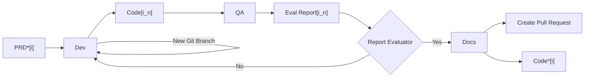
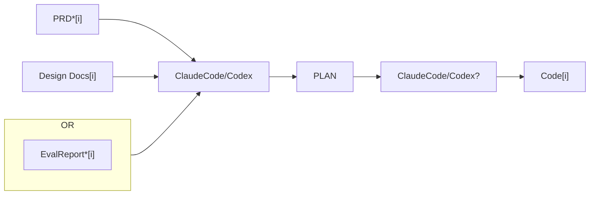
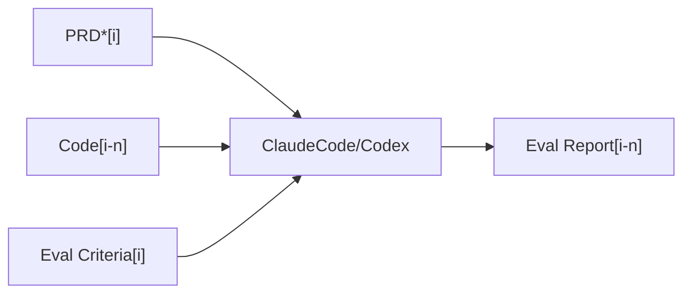
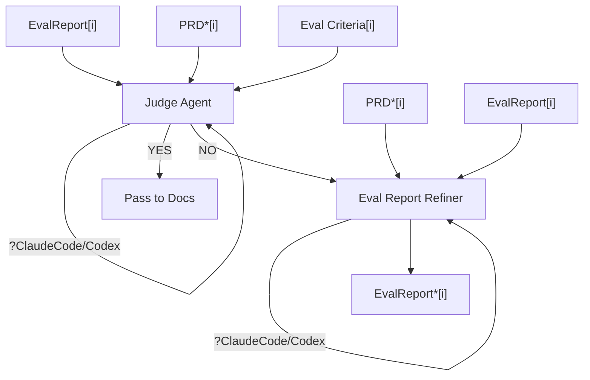
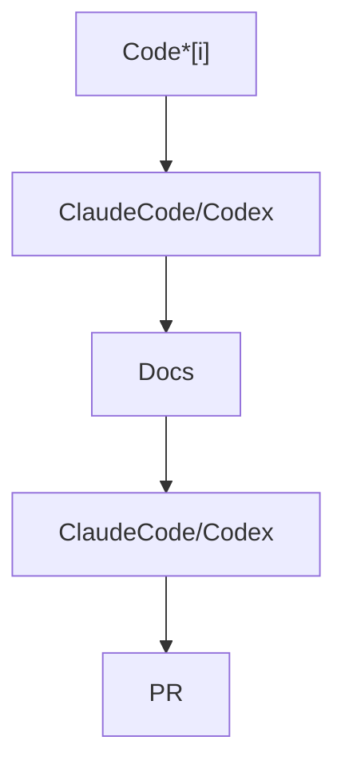

## → Project Planning:

**(A)** Overall Vision and Architecture
**(B)** Break down into Features with clear goals & User Stories
	→ Clear Evaluation for each feature

### 📋 Project Plan

```
				  → feature₁  → PRD₁
				  → feature₂  → PRD₂
                  → feature₃  → PRD₃
  📋 Project Plan  → featureₙ  → PRD₄
				   → feature₅  → PRD₅
                   → feature₆  → PRD₆
```


### FDE (Feature Development Engine)


→ We have $PRD_i$ where we have $i$ PRDs to develop (1-indexed)
→ $PRD_i$  : $feature_j$ has a **MANY:1** relation
→ For Optimization we will need to run the PRDs that doesn't overlap in parallel.
    ↳ can be deferred to later as adds complexity.

#### Terminology
- $feature_j$ - The feature that the user expects to build based on the Project Plan. It can result in 1 or more PRDs depending on the complexity of the feature.  
- $PRD_i$  - Initial PRD that is optimized for expectation of what needs to be created and how to evaluate for completeness. 
- $PRD^*_i$ - Optimized PRD that builds on $PRD_i$  to create other assets that would be required in setting up the env/filesystem properly for the development of the feature. Also refines the PRD to make it inline with best practices for specific components used. 
-  $Code_{i_n}$ - The Code that is created by the Dev Component which the QA evaluates to create the $Eval Report_{i_n}$. The optimization loop for Code runs for $n$ iterations for each $i$th feature, where $n$ is controlled by a stopping condition. 
- $Code^*_i$ - The final code for $PRD^*_i$ after the optimization loop of code and documentation. 
### Engines:
1. **Feature Dev Engine ($PRD^*_i$ )** → $Code^*_i$
2. **PRD Refiner ( $PRD_i$ )** →  $PRD^*_i$  (might give additional assets for running claude code or codex agents efficiently for the project).
> **Note:** At the moment, the project plan and feature mapping/scoping part of a project will be completely manual.


## Components: 

They will run in YOLO MODE in a Sandbox
### ① Dev:



### ② QA:




### ③ Report Eval:



### ④ Docs:



---

### Questions:-

**(+)** Should each of the component run in a separate sandbox or the same one when in the same engine?
**(+)** Should each of the component have a new agent session or the continuation of the previous one?
**(+)** Do passing between each component create a git commit or git branch?

---
## Ingredients:

**(+) Strong VM Sandbox**          
    ↳ Cheap/Affordable
    ↳ Secure/Open Source
    ↳ Easy to Setup/Use
**(+) GitHub**
**(+) Claude Code / Codex**
**(+) Sandbox Setup for Components:**

```
  ┌──────────────┐
  │   ┌───────┐  │
  │   │  Dev  │  |──────→ Agent.md
  │   ├───────┤  │
  │   │  QA   │  |──────→ Tasks.md
  │   ├───────┤  │
  │   │Report │  |──────→ Notes.md
  │   │ Eval  │  │
  │   ├───────┤  │──────→ Memory Database (VDB + SQL)
  │   │ Docs  │  │
  │   └───────┘  │
  └──────────────┘
```

### Questions:

 **(+)** What Sandbox to use?
 **(+)** What does it take for a ClaudeCode/Codex agent to perform optimally on a task in YOLO mode? What is the optimal directory/file structure?
 **(+)** How do we handle memory at different levels about the codebase?
     **⊖ Inter Component**
         → Among components in an engine **(Engine level)**
         → Among components of same type/goal
    - **⊖ Inter Engine**
    - **⊖ Component Level**
**(+)** Should the agent run outside the Sandbox and control it externally?
**(+)** **What defines the $EvalCriteria_i$?** This is the linchpin. If the eval criteria are vague, the Judge Agent will be unreliable. Is this generated from the PRD? Hand-written? Both? This deserves its own section.
**(+)** **The PRD Refiner could be a bottleneck** — If PRD* is poorly optimized, every downstream component suffers. Have you considered making the refiner iterative too (refine → dev → if dev struggles → refine again)?


### Things to Clarify 
- **The stopping condition for the Dev↔QA loop** — You mention nn n iterations controlled by a stopping condition, but what is it? Max iterations? Judge confidence score? Test pass rate? This matters enormously for cost control.
- **Context loss between components** — When Dev produces Code[i] and hands it to QA, what context gets passed? The full agent conversation? Just the code diff? Your Notes.md / Agent.md / Tasks.md files in the sandbox diagram suggest you're thinking about this, but the handoff protocol is underspecified.
- **Git Strategy** - I'd suggest: **branches per feature, commits per component completion**. This gives you rollback granularity.